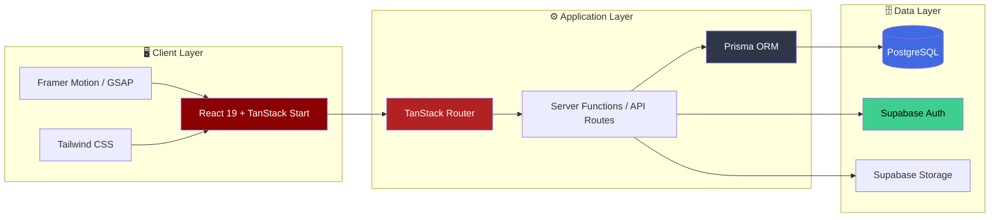
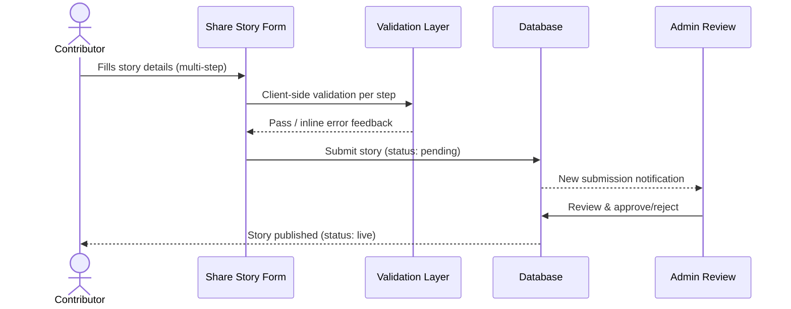
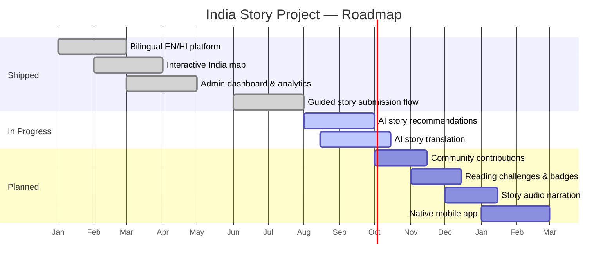
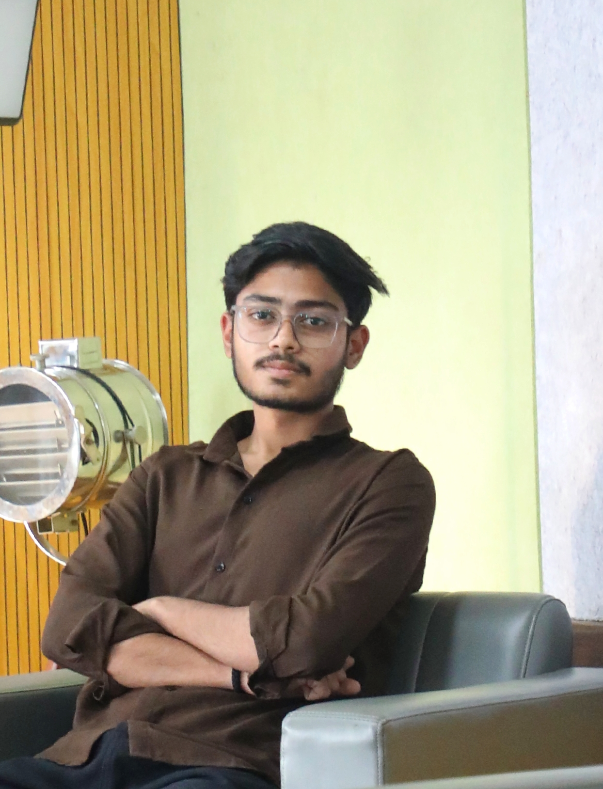

<div align="center">


<br/><br/>

<table align="center">
<tr>
<td align="center"><b>📚 400+</b><br/><sub>Stories Live</sub></td>
<td align="center"><b>🗺️ 28+</b><br/><sub>States Covered</sub></td>
<td align="center"><b>🌐 2</b><br/><sub>Languages</sub></td>
<td align="center"><b>⚡ 100</b><br/><sub>Lighthouse</sub></td>
<td align="center"><b>🎬 60fps</b><br/><sub>Motion Everywhere</sub></td>
</tr>
</table>

<br/>

<a href="https://www.indiastoryproject.com/">

</a>
<a href="https://github.com/pradhummandil/india-story-project">

</a>
<a href="https://github.com/pradhummandil/india-story-project/issues">

</a>

<br/><br/>


&nbsp;

&nbsp;


<br/><br/>


<br/>


<br/>

<sub>✦ Built with ❤️ in India · Preserving stories, one pixel at a time ✦</sub>

</div>


<br/>

## 📑 Table of Contents

<details open>
<summary>Click to expand</summary>

- [📖 About the Project](#-about-the-project)
- [🎬 Design & Motion Experience](#-design--motion-experience)
- [📊 How ISP Compares](#-how-isp-compares)
- [✨ Features](#-features)
- [🏗 Tech Stack](#-tech-stack)
- [🧩 System Architecture](#-system-architecture)
- [📈 Growth Trajectory](#-growth-trajectory)
- [📂 Project Structure](#-project-structure)
- [🚀 Getting Started](#-getting-started)
- [📸 Major Modules](#-major-modules)
- [🔒 Security](#-security)
- [🗺️ Roadmap](#️-roadmap)
- [📊 Repo Analytics](#-repo-analytics)
- [🤝 Contributing](#-contributing)
- [👨‍💻 Meet the Developers](#-meet-the-developers)
- [⭐ Support](#-support)
- [📄 License](#-license)

</details>

<br/>

## 📖 About the Project


**India Story Project** is a premium editorial storytelling platform built to preserve and showcase India's untold stories — the changemakers, the quiet revolutions, and the everyday heroes shaping the subcontinent.

Unlike a traditional blog, this platform is engineered as an **immersive, cinematic experience** — layered motion design, glass-morphism navigation, an interactive map-based exploration of India, full bilingual support, and a scalable production-grade backend.

> *"Every scroll, hover, and transition should feel like turning the page of a premium storybook — not loading a static blog."*

🔗 **Live Experience:** [indiastoryproject.com](https://www.indiastoryproject.com/) — best viewed with sound off, scroll on. 🎧

<br clear="right"/>

<div align="center">

| 📚 400+ | 🗺️ 28+ | 🌐 2 | ⚡ 100 |
|:---:|:---:|:---:|:---:|
| Stories Published | States Covered | Languages | Lighthouse Score |

</div>

<br/>

## 🎬 Design & Motion Experience

<div align="center">

</div>

| Element | Details |
|---|---|
| 🌌 **Cinematic Landing** | Full-viewport hero with layered parallax scroll and gradient depth |
| 🗺️ **Interactive India Map** | Hover/tap-driven state exploration with depth-based scaling & glow transitions |
| ✨ **Motion Engine** | Powered by **GSAP** (scroll-triggered timelines) + **Framer Motion** (component-level micro-interactions) |
| 🪟 **Glass Navigation** | Frosted-glass navbar with dynamic blur on scroll |
| 🎨 **Editorial Theme** | Deep maroon-and-ivory palette with accent gradients per category/state |
| 🎞️ **Page Transitions** | Smooth cross-fade & slide transitions between routes via TanStack Router |
| 🔢 **Animated Counters** | Impact stats count up into view using spring physics |
| 📱 **Adaptive Motion** | Animations scale down gracefully on mobile for performance |
| ♿ **Reduced-Motion Aware** | Full respect for `prefers-reduced-motion` across every animated surface |

<br/>

## 📊 How ISP Compares

<div align="center">

<sub>Benchmarked against The Better India, an established Indian positive-news platform — self-assessed, for internal tracking purposes</sub>

<br/><br/>


<br/><br/>


</div>

**Reading it straight:** ISP leads on design, UI, and motion — the product experience people actually feel first. The Better India leads on content depth, functionality, and monetization, because it's a staffed, funded media company with years of editorial output. The radar shape makes the trade-off obvious at a glance: ISP is the sharper, more modern shell; TBI is the deeper, more complete machine. Closing that gap is the active roadmap.

<br/>

## ✨ Features

<table>
<tr>
<td width="50%" valign="top">

### 📚 Story Platform
- 400+ curated Indian stories
- Rich story detail pages with reading progress & estimated reading time
- Story categories & themes
- State-wise story archive
- Search & advanced filtering
- Related stories & story views
- Hero story of the day + featured stories
- Fully responsive layout

### 🌏 Explore India
- Interactive, animated India map
- State-wise story navigation
- Region & category discovery
- Explore by theme

</td>
<td width="50%" valign="top">

### 🌐 Multilingual
- English & Hindi interface
- Dynamic language toggle
- Localized categories and states

### 👤 Authentication
- Email login & signup
- Google authentication (OAuth)
- Password reset & email verification
- Secure session management
- Powered by Supabase Auth

### 👑 Admin Dashboard
- Secure admin login with role-based authorization
- Story, user, category & theme management
- Featured / hero story control
- Analytics dashboard with view statistics

</td>
</tr>
</table>

### 🎨 Premium UI
Editorial, cinematic design language · Smooth animations & glass navigation · Deep maroon luxury theme · Mobile-first, performance-optimized

<br/>

## 🏗 Tech Stack

<div align="center">

### Frontend


### Motion / 3D

&nbsp;&nbsp;


### Backend & Database


### Deployment & Tooling


<br/><br/>


</div>

<br/>

## 🧩 System Architecture



<details>
<summary>📥 Story Submission Flow (click to expand)</summary>



</details>

<br/>

## 📈 Growth Trajectory

<div align="center">


<sub>Illustrative growth curve — update with real analytics once available</sub>

</div>

<br/>

## 📂 Project Structure

```
india-story-project/
├── src/
│   ├── components/     # Reusable UI components
│   ├── routes/         # App routes (TanStack Router)
│   ├── lib/             # Utilities & shared logic
│   ├── hooks/           # Custom React hooks
│   ├── generated/       # Auto-generated files (e.g. Prisma client)
│   └── styles/          # Global styles & motion tokens
├── prisma/               # Prisma schema & migrations
├── public/               # Static assets
└── scripts/              # Build & maintenance scripts
```

<br/>

## 🚀 Getting Started

### Prerequisites


<br/>

**1. Clone the Repository**
```bash
git clone https://github.com/pradhummandil/india-story-project.git
cd india-story-project
```

**2. Install Dependencies**
```bash
npm install
```

**3. Configure Environment Variables**

Create a `.env` file in the root directory:
```env
DATABASE_URL=
DIRECT_URL=

VITE_SUPABASE_URL=
VITE_SUPABASE_ANON_KEY=
SUPABASE_SERVICE_ROLE_KEY=
```

**4. Generate Prisma Client**
```bash
npx prisma generate
```

**5. Run the Development Server**
```bash
npm run dev
```

**6. Production Build**
```bash
npm run build
```

<br/>

## 📸 Major Modules

| Module | Description |
|---|---|
| 🏠 Home | Cinematic landing experience |
| 🗺️ Explore India | Interactive map-based story discovery |
| 📚 Stories Archive | Full searchable & filterable story catalog |
| 📖 Story Detail | Rich reading experience with progress tracking |
| 🔐 Login / Signup | Secure authentication flows |
| 👤 User Profile | Personalized user space |
| 👑 Admin Dashboard | Full content & analytics control panel |
| 💬 Community | User engagement & contributions |
| ✍️ Share Your Story | Guided multi-step story submission flow |

<br/>

## 🔒 Security

- 🔑 JWT-based authentication
- 🛡️ Role-based access control (RBAC)
- 🚧 Protected API routes
- 🗄️ Prisma ORM for safe database access
- ✅ Server-side validation on all inputs
- 🔒 Secure session management via Supabase

<br/>

## 🗺️ Roadmap



- [x] Bilingual EN/HI storytelling platform
- [x] Interactive India map exploration
- [x] Admin dashboard & analytics
- [x] Guided multi-step story submission
- [ ] 🤖 AI-powered story recommendations
- [ ] 🌐 AI story translation
- [ ] 🙌 Community contributions & reactions
- [ ] 🏆 Reading challenges & achievement badges
- [ ] 📊 Leaderboards
- [ ] 🕰️ Interactive historical timeline
- [ ] 📴 Offline reading mode
- [ ] 📱 Native mobile app
- [ ] 🎙️ Story audio narration

See the [open issues](https://github.com/pradhummandil/india-story-project/issues) for the full list of proposed features and known issues.

<br/>

## 📊 Repo Analytics

<div align="center">


<br/>


</div>

<br/>

## 🤝 Contributing

Contributions are what make the open-source community such an amazing place to learn, inspire, and create. Any contributions you make are **greatly appreciated**.

1. Fork the repository
2. Create your feature branch (`git checkout -b feature/AmazingFeature`)
3. Commit your changes (`git commit -m 'Add some AmazingFeature'`)
4. Push to the branch (`git push origin feature/AmazingFeature`)
5. Open a Pull Request


## 👨‍💻 Meet the Developers

<div align="center">

### The Team Behind the Stories

</div>

<table align="center" width="100%">
<tr>
<td align="center" width="50%">


### Pradhum Mandil
**Full Stack Developer & Creative Technologist**

📍 India

Founder-minded builder passionate about scalable web apps, AI-powered platforms, and cinematic digital experiences. Drives the product vision, UI/motion direction, and frontend architecture of India Story Project.

**Core Stack:**


[](https://www.linkedin.com/in/pradhum-m-b69b66318/)
[](https://github.com/pradhummandil)


</td>
<td align="center" width="50%">



### Mayank Sahu
**Full Stack Developer**

📍 India

Focused on backend engineering, databases, and cloud infrastructure — the engine that keeps 400+ stories, auth, and analytics running smoothly at scale.

**Core Stack:**


[](https://www.linkedin.com/in/mayank-sahu-77653324a/)
[](https://github.com/Mayank084)


</td>
</tr>
</table>

<br/>

## ⭐ Support

If you found this project useful, consider giving it a ⭐ on GitHub — it motivates us to continue preserving India's incredible stories through technology.

<div align="center">

[](https://github.com/pradhummandil/india-story-project)
[](https://github.com/pradhummandil/india-story-project/fork)
[](https://github.com/pradhummandil/india-story-project)

</div>

<br/>

## 📄 License

Distributed under the MIT License. See `LICENSE` for more information.

<br/>


<div align="center">
<sub>🇮🇳 Every Story Connects India — Built with ❤️ in India</sub>
<br/>
<sub>© 2026 India Story Project. All stories belong to their storytellers.</sub>
</div>
